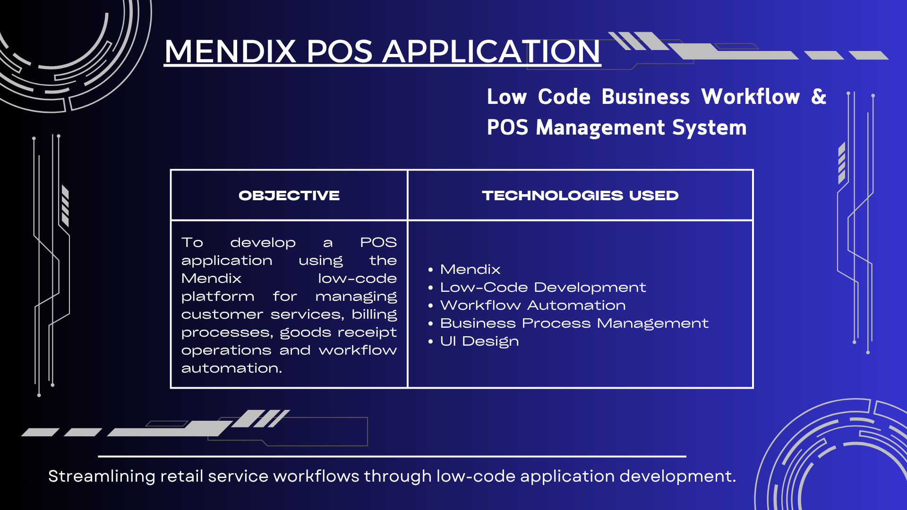
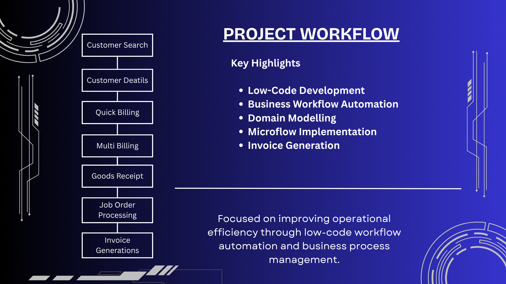

# Mendix POS Application

## 🚀 Overview
This project focuses on developing a Point of Sale(POS) application using the Mendix low-code platform for managing customer service workflows, billing processes, goods receipt operations and job order management.

The application was designed to improve operational efficiency through workflow automation and low-code development concepts.

## 🏢 Internship Experience
The project was developed during my internship experience at "Titan Company Limited, Bangalore", where I worked as a Mendix Trainee within the Corporate IT Digital team.

During the internship, I gained hands-on experience in low-code application development, business workflow automation, domain modelling, microflows and enterprise application design using the Mendix platform.

Internship Duration : July 2022 - August 2022

## 🎯 Objective
To design and develop a workflow-driven POS application that simplifies customer service operations, billing activities, goods recept management and service order processing.

## 🛠 Technologies Stack
| Category | Tools / Platform |
|------------|----------------|
| Development Platform | Mendix |
| Development Approach | Low-Code Development |
| Business Process | Workflow Automation |
| Database Concepts | Domain Modelling |
| Design | UI Design |
| Domain | POS Management |

## 📊 Project Workflow
```text
Customer Search & Verification
   ↓
Customer Information Management
   ↓
Quick Billing
   ↓
Multi Billing
   ↓
Goods Recepit Processing
    ↓
Service Job Order Management
    ↓
Invoice Generation
```

## ✨ Key Learnings
- Low-Code Application Developement
- Domain Model Design
- Business Workflow Automation
- Microflows & Business Logic
- Enterprise Application Development Concepts
- UI Design Principles
- Agile Development Concepts

## 📷 Project Presentation





The project presentation slides and supporting documentation are included in this repository.

## 📈 Project Outcome 
Successfully demonstrated a workflow-oriented POS application using Mendix, demonstarting how low-code platforms can accelerate enterprise application development and improve workflow management.

## 👩‍💻 Author
 
**Varsha Sundararaj**

Business Analytics Postgraduate @ Dublin Business School 

Aspiring Data Analyst | NLP | SQL | Python

## 🔗 Connect With Me
- LinkedIn: https://www.linkedin.com/in/varsha-sundararaj-40a463201
- GitHub: https://github.com/varshasundararaj-analytics
